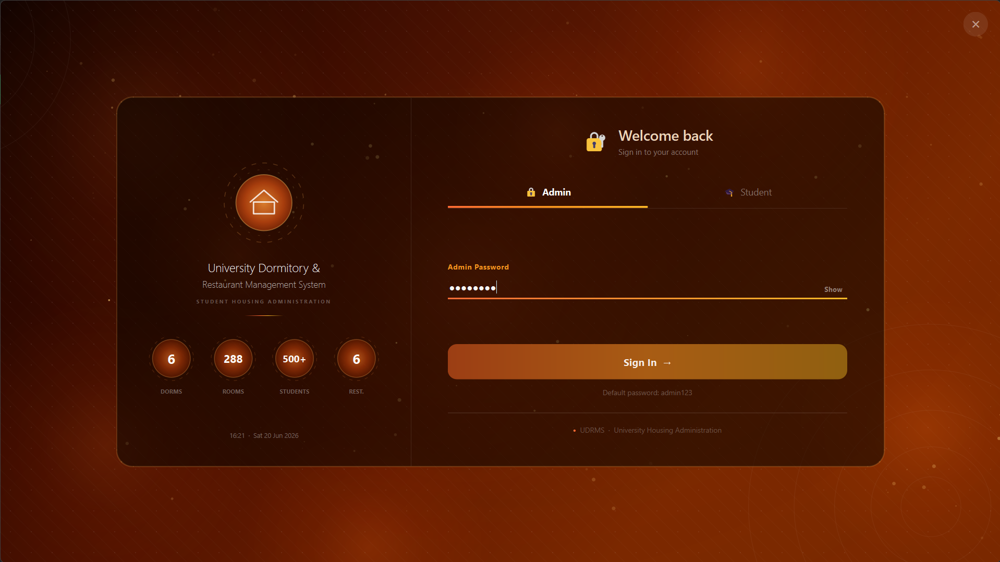
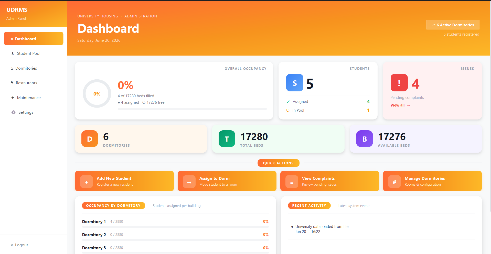
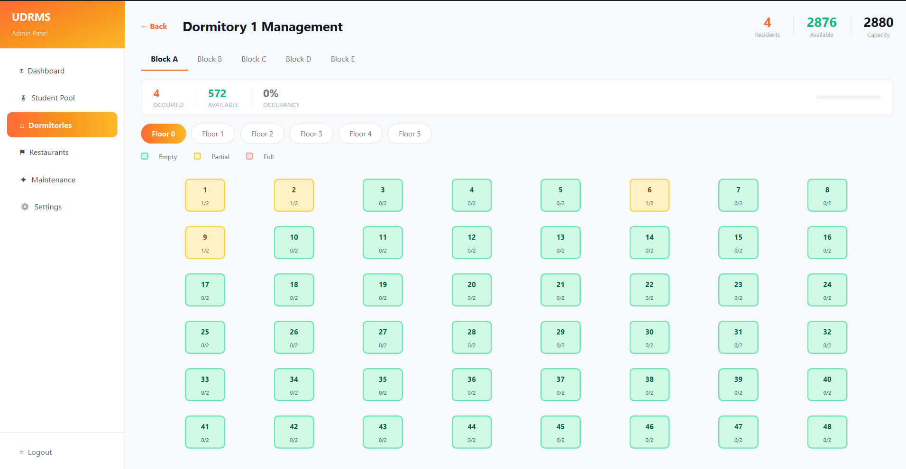
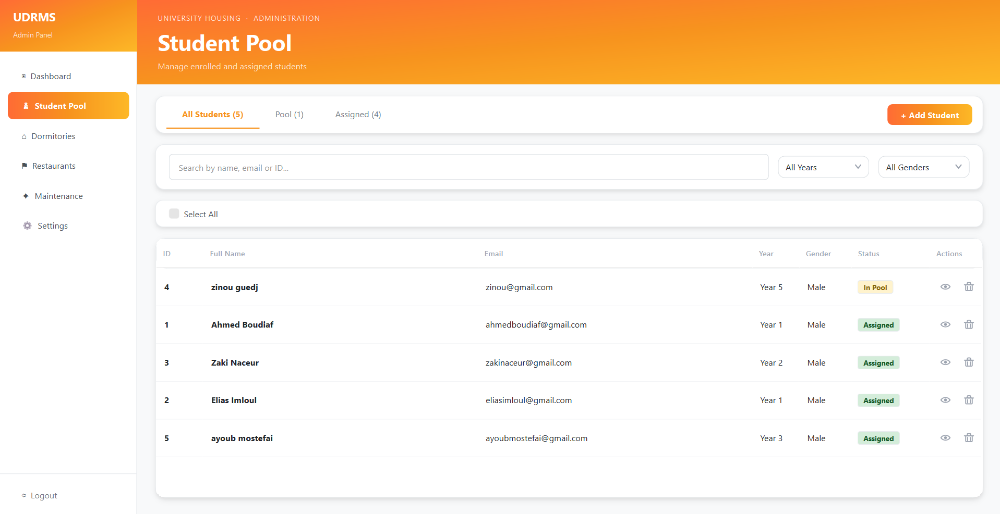
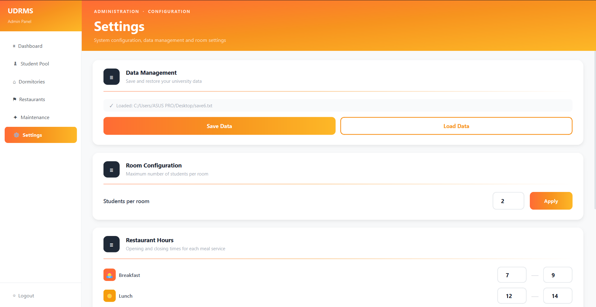
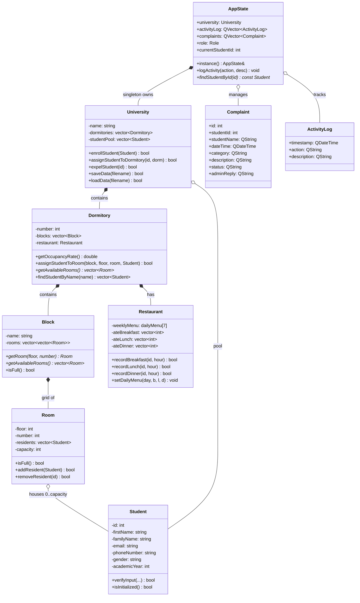

<p align="center">
  
</p>

<h1 align="center">UDRMS — University Dormitory & Restaurant Management System</h1>

<p align="center">
  <strong>A modern desktop application for managing university dormitories, restaurants, and student life.</strong>
</p>

<p align="center">
  
  
  
</p>

---

## Features

### 🏠 Dormitory Management
- **Hierarchical structure** — University → Dormitories → Blocks → Floors → Rooms
- **Visual floor plans** — Color-coded room squares showing occupancy status
- **Student assignment** — Cascading pickers for dorm/block/floor/room selection
- **Student pool** — Track unassigned students with search, filter, and bulk actions

### 🍽️ Restaurant & Meal Tracking
- **Weekly menus** — Configure breakfast, lunch, and dinner for each day
- **Meal recording** — Track which students have eaten, with time-window validation
- **Menu editor** — Easy-to-use dialog for updating daily menus

### 👤 Student Management
- **Full CRUD** — Add, edit, view, and expel students
- **Student profiles** — View personal info, dorm assignment, complaint history
- **Student portal** — Students can update their info, view meals, and file complaints

### 📋 Complaints & Maintenance
- **Complaint tracking** — Students can submit complaints; admins can reply and resolve
- **Maintenance requests** — Filterable table with status management
- **Activity logging** — All admin actions are recorded with timestamps

### 🔐 Authentication
- **Dual role system** — Admin and Student login
- **Animated login UI** — Glowing badges, floating labels, animated gradient background

### 📊 Dashboard & Reporting
- **Admin dashboard** — Occupancy rates, student counts, pending issues, activity feed
- **Circular progress indicators** — Visual occupancy stats
- **Per-dormitory statistics** — Capacity, availability, occupancy rates

---

## Screenshots







---

## Installation

### Windows

1. Download the latest release from the [Releases](https://github.com/EliasImloul/UDRMS/releases) page
2. Run `UDRMS.exe`

### Build from Source

#### Prerequisites

- **Qt 6** (with `core`, `gui`, `widgets` modules)
- **MinGW 64-bit** or MSVC compiler
- **qmake** (included with Qt)

#### Steps

```bash
git clone https://github.com/EliasImloul/UDRMS.git
cd UDRMS

# Create build directory
mkdir build
cd build

# Configure and build
qmake ../UDRMS.pro
make
```

Or open `UDRMS.pro` in Qt Creator and build from the IDE.

---

## Project Structure

```
UDRMS/
├── src/                      # Source code
│   ├── main.cpp              # Application entry point
│   ├── student.h/.cpp        # Student model
│   ├── room.h/.cpp           # Room model
│   ├── block.h/.cpp          # Block model (floor × room grid)
│   ├── dormitory.h/.cpp      # Dormitory model
│   ├── restaurant.h/.cpp     # Restaurant & menu model
│   ├── university.h/.cpp     # Central model (dorms, pool)
│   ├── appstate.h/.cpp       # Singleton app state (persistence)
│   ├── stylehelper.h         # Qt stylesheet helpers
│   ├── constants.h           # App-wide constants
│   ├── AdminMainWindow.h/.cpp
│   ├── StudentMainWindow.h/.cpp
│   ├── LoginDialog.h/.cpp
│   ├── dialogs/              # Reusable modal dialogs
│   └── widgets/              # Page widgets for admin & student
├── resources/
│   ├── resources.qrc         # Qt resource file
│   └── styles/styles.qss     # Global stylesheet
├── screenshots/              # Application screenshots
├── UDRMS.pro                 # Qt project file (qmake)
├── README.md
└── LICENSE
```

---

## Technologies

| Technology | Purpose |
|-----------|---------|
| **C++17** | Core application logic |
| **Qt 6**  | GUI framework (Widgets, Core, Gui) |
| **qmake** | Build system |
| **JSON**  | Data persistence (save/load) |

---

## Class Architecture



#### GUI Layer

```
LoginDialog → AdminMainWindow / StudentMainWindow
           → DashboardWidget, DormitoriesWidget, RestaurantsWidget, ...
           → dialogs: AddStudentDialog, AssignToDormDialog, ...
```

---

## License

Distributed under the MIT License. See [LICENSE](LICENSE) for more information.
