# UDRMS — Class Architecture

```mermaid
classDiagram
    class University {
        -name: string
        -dormitories: vector~Dormitory~
        -studentPool: vector~Student~
        +enrollStudent(Student) bool
        +assignStudentToDormitory(id, dorm) bool
        +unassignStudent(id) bool
        +expelStudent(id) bool
        +addDormitory(Dormitory) bool
        +removeDormitory(number) bool
        +isEmailDuplicate(email) bool
        +isPhoneDuplicate(phone) bool
        +locateStudent(id) string
        +getTotalCapacity() int
        +saveData(filename) bool
        +loadData(filename) bool
    }

    class Dormitory {
        -number: int
        -blocks: vector~Block~
        -restaurant: Restaurant
        +getOccupancyRate() double
        +getTotalOccupancy() int
        +getTotalCapacity() int
        +getAvailableRooms() vector~Room~*
        +getFullRooms() vector~Room~*
        +getRoomsByFloor(floor) vector~Room~*
        +assignStudentToRoom(block, floor, room, Student) bool
        +unassignStudent(id) bool
        +moveStudent(id, dstBlock, dstFloor, dstRoom) bool
        +findStudentsByName(name) vector~Student~
        +filterStudentsByYear(year) vector~Student~
        +getAllAssignedStudents() vector~Student~
        +isFull() bool
        +isStudentIn(id) bool
        +addStudent(Student) bool
        +swapStudents(id1, id2) bool
    }

    class Block {
        -name: string
        -rooms: vector~vector~Room~~
        +getName() string
        +getRoom(floor, number) Room*
        +getAvailableRooms() vector~Room~*
        +getFullRooms() vector~Room~*
        +getTotalOccupancy() int
        +findRoomByStudentID(id) Room*
        +isFull() bool
    }

    class Room {
        -floor: int
        -number: int
        -residents: vector~Student~
        -capacity: static int
        +getFloor() int
        +getNumber() int
        +getCapacity() static int
        +getCurrentOccupancy() int
        +setCapacity(cap) static void
        +isFull() bool
        +isOccupied() bool
        +addResident(Student) bool
        +removeResident(id) bool
        +clearResidents() void
        +findResidentById(id) Student*
    }

    class Student {
        -id: int
        -firstName: string
        -familyName: string
        -email: string
        -phoneNumber: string
        -gender: string
        -academicYear: int
        +getId() int
        +getFirstName() string
        +getFamilyName() string
        +getEmail() string
        +getPhoneNumber() string
        +getGender() string
        +getAcademicYear() int
        +setFirstName(name) bool
        +setFamilyName(name) bool
        +setEmail(email) bool
        +setPhoneNumber(phone) bool
        +setGender(gender) bool
        +setAcademicYear(year) bool
        +setStudent(...) bool
        +verifyInput(...) bool
        +isInitialized() bool
        +getIdCount() static int
    }

    class Restaurant {
        -weeklyMenu: dailyMenu[7]
        -ateBreakfast: vector~int~
        -ateLunch: vector~int~
        -ateDinner: vector~int~
        +getDailyMenu(day) dailyMenu
        +getWeeklyMenu() dailyMenu*
        +setDailyMenu(day, breakfast, lunch, dinner) void
        +setWeeklyMenu(sun, mon, tue, wed, thu, fri, sat) void
        +recordBreakfast(studentId, hour) bool
        +recordLunch(studentId, hour) bool
        +recordDinner(studentId, hour) bool
        +didStudentEatBreakfast(id) bool
        +didStudentEatLunch(id) bool
        +didStudentEatDinner(id) bool
        +resetDailyMeals() void
        +isOpen(hour) bool
        +getDishName(dish) static string
        +getMorningDishName(dish) static string
        +getDayName(day) static string
    }

    class dailyMenu {
        +breakfast: morningDish
        +lunch: dish
        +dinner: dish
    }

    class AppState {
        +university: University
        +role: Role
        +currentStudentId: int
        +activityLog: QVector~ActivityLog~
        +complaints: QVector~Complaint~
        +complaintIdCounter: int
        +instance() AppState&
        +logActivity(action, desc) void
        +findStudentById(id) const Student*
        +findStudentDorm(id) Dormitory*
        +allStudents() QVector~Student~
        +updateStudentData(...) bool
        +assignStudentToRoom(...) bool
    }

    class Complaint {
        +id: int
        +studentId: int
        +studentName: QString
        +dateTime: QDateTime
        +category: QString
        +description: QString
        +status: QString
        +adminReply: QString
    }

    class ActivityLog {
        +timestamp: QDateTime
        +action: QString
        +description: QString
    }

    University  *--  Dormitory  : contains
    Dormitory   *--  Block      : contains
    Block       *--  Room       : grid of
    Room        o--  Student    : houses 0..capacity
    Dormitory   *--  Restaurant : has
    University   o--  Student   : pool
    Restaurant  *--  dailyMenu  : weeklyMenu[7]
    AppState    *--  University : singleton owns
    AppState    o--  Complaint  : manages
    AppState    o--  ActivityLog : tracks
```



### Enums

| Enum | Values |
|------|--------|
| `AppState::Role` | `ADMIN`, `STUDENT` |
| `Restaurant::day` | `Sunday` – `Saturday` |
| `Restaurant::morningDish` | `CoffeeMilk_and_Croissant`, `Yogurt_and_ChocolateBread`, `Tea_and_ChocolateBar` |
| `Restaurant::dish` | `Couscous`, `Rechta`, `Spaghetti`, `Sardines`, `Chorba`, `Lentil_Soup`, `Chakhchoukha`, `Loubia`, `Rice`, `Tajjine`, `Tlitli`, `Mtewem`, `Jwaz`, `Fried_Chicken` |

### GUI Layer

```
LoginDialog → AdminMainWindow / StudentMainWindow
           → DashboardWidget, DormitoriesWidget, RestaurantsWidget, ...
           → dialogs: AddStudentDialog, AssignToDormDialog, ...
```

> PlantUML version also available: [`architecture.puml`](architecture.puml)
